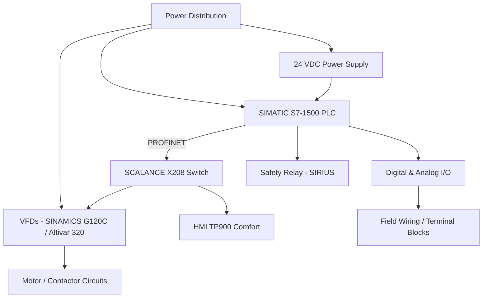

# Industrial Electrical Control Cabinet Design using EPLAN

## 📌 Project Overview

This repository documents the complete engineering design of an industrial electrical control cabinet, developed using **EPLAN Electric P8** and **EPLAN Pro Panel**. The project covers the full design cycle of the cabinet: electrical schematics, component selection, wiring documentation, physical 3D cabinet layout, 2D panel layout, drilling documentation, thermal analysis, and the bill of materials (BOM).

The cabinet integrates a Siemens SIMATIC S7-1500 PLC, PROFINET communication, variable frequency drives, safety circuitry, digital/analog I/O, an HMI, and the associated power distribution, protection, and terminal infrastructure required to operate them.

This is an **engineering/design project**. It represents a complete design package produced in EPLAN and does not claim installation or commissioning in an operating industrial facility.

## 🎯 Project Objectives

- Design a complete electrical architecture for an industrial control cabinet, from power distribution to field wiring.
- Configure a Siemens S7-1500 PLC system with digital and analog I/O.
- Implement PROFINET-based communication between the PLC, HMI, VFDs, and network switch.
- Integrate a dedicated safety circuit using a SIRIUS safety relay.
- Select and document VFDs and motor-control components for variable-speed motor control.
- Design the physical cabinet layout in 3D using EPLAN Pro Panel, including component placement and cable routing.
- Produce 2D manufacturing documentation (panel layout and drilling views).
- Perform a thermal analysis and select an appropriate cooling solution.
- Generate a consolidated parts list (BOM) directly from the EPLAN project.

## 🏗️ System Architecture

The cabinet is organized around a central PLC that communicates over PROFINET with the HMI, the variable frequency drives, and the industrial Ethernet switch, while power distribution, protection, and safety circuits supply and safeguard the connected field devices.

## ⚡ Power Distribution

The power distribution section contains the main protection and distribution components of the cabinet.

| Component | Manufacturer | Reference | Role |
|---|---|---|---|
| Molded case circuit breaker (MCCB) | Siemens | SIE.3VA1132-5EF32-0AA0 | Main circuit protection |
| Main switch, Compact INS63, 3P, 63 A | Schneider Electric | SE.28902 | Main disconnect switch |
| Surge protection device (SPD) | Schneider Electric | SE.A9L16634 | Overvoltage protection |
| MCB, Acti9 iC60N, 2P, 2 A, curve C | Schneider Electric | SE.A9F74202 | Circuit protection |
| MCB, Acti9 iC60N, 2P, 10 A, curve C | Schneider Electric | SE.A9F77210 | Circuit protection |

These components provide the main incoming protection, disconnection, and branch-circuit protection for the cabinet's downstream loads.

## 🧠 PLC & I/O

The automation core of the cabinet is a **Siemens SIMATIC S7-1500** CPU, which manages the digital and analog signals exchanged with the field and drive equipment.

| Function | Reference |
|---|---|
| CPU 1511-1 PN | 6ES7511-1AK02-0AB0 |
| Digital Input module | SIE.6ES7521-1BH50-0AA0 |
| Digital Output module | SIE.6ES7522-1BH10-0AA0 |
| Analog Input module | SIE.6ES7531-7KF00-0AB0 |
| Analog Output module | SIE.6ES7532-5NB00-0AB0 |

The CPU processes the digital and analog inputs from field devices and instrumentation, and drives the digital and analog outputs used to control the connected equipment. Exact channel assignments are documented within the EPLAN project pages and are not detailed here.

## 🌐 PROFINET Communication

The project uses **PROFINET** as the industrial Ethernet communication protocol connecting the automation equipment.

- **Industrial Ethernet switch:** Siemens SCALANCE X208 (6GK5008-0BA10-1AB2)

PROFINET links the PLC, the HMI, the variable frequency drives, and the switch, allowing centralized monitoring and control of the automation system over a single industrial network.

## 🛡️ Safety System

Safety functions are handled by a dedicated **Siemens SIRIUS safety relay** (3SK1111-1AB30), which provides the safety-control infrastructure of the cabinet. This component forms the basis of the safety circuit documented on the EPLAN safety pages; detailed safety wiring is available in the project files.

## ⚙️ VFD & Motor Control

The cabinet includes multiple variable-speed drives for motor speed and control:

- **Siemens SINAMICS G120C** – 6SL3210-1KE15-8UF2 (additional references in the BOM: 6SL3210-1KE14-3UP2, 6SL3210-1KE31-1UF1)
- **Schneider Altivar 320** – ATV320U40N4C, 4 kW, 380–500 V, 3-phase compact VFD
- **SINAMICS G120 BOP/BOB-2 door mounting kit** – 6SL3256-0AP00-0JA0

The VFD section covers motor speed control, drive integration with the automation system, and communication with the PLC network. Power and control wiring are kept separated throughout the design, in line with standard drive-installation practice. Exact motor ratings and terminal-level wiring are documented in the EPLAN project and are not reproduced here.

### Motor / Contactor Circuits

| Component | Reference | Quantity (BOM) |
|---|---|---|
| Motor circuit breaker | SIE.3RV2011-1JA10 | 4 |
| Auxiliary switch | SIE.3RV2901-1E | 4 |
| Contactor, LC1D09P7 | LC1D09P7 | 5 |

These components form the motor protection and switching circuits associated with the drives and motor loads.

## 🔌 Digital & Analog I/O

Digital and analog I/O wiring is documented on dedicated EPLAN pages (Digital Input, Digital Output, Analog Input, Analog Output), connecting the PLC I/O modules to field instrumentation and control devices, including:

- SICK photoelectric retro-reflective sensor (W9L-P430, internal ref. 1023958)
- Humidity probe (TM1SH304)
- Thermal probe, PT1000 (TM1STPT…)
- Schneider Modicon M171 optimized wall thermostat (TM171DWAL2L)

Signal-level details and exact wiring are contained in the EPLAN project and are not reproduced in this README.

## 🔋 24 VDC Control

The cabinet's control voltage is supplied by:

- **Siemens SITOP PSE200U** – 6EP1961-2BA41
- **Siemens power supply** – 6EP3333-8SB00-0AY0

Both units appear in the project as 24 VDC-related power supplies; their specific functional assignment within the cabinet is defined in the EPLAN project documentation.

## 📦 Terminal Block Organization

Field and control wiring is organized using **Phoenix Contact** terminal block components:

| Component | Reference | Description |
|---|---|---|
| Feed-through terminal block | PXC.3211814 | PT 6 |
| Feed-through terminal block | PXC.3211813 | PT 6 |
| Fuse terminal block | PXC.3036550 | ST 4-HESILED 60 (5x20) |
| Test-disconnect terminal block | PXC.3212140 | PTME 4 WH |
| End cover | PXC.3212044 | D-PT 6 |
| End clamp | PXC.3022218 | CLIPFIX 35 |
| Partition/separator | PXC.3030721 | ATP-ST 4 |

The terminal system separates field wiring, digital I/O, analog I/O, +24 VDC, 0 V, PE, and control connections, ensuring clear functional organization and simplifying commissioning, troubleshooting, and future maintenance.

## 🗄️ Rittal Cabinet Design

The main enclosure is a **Rittal VX enclosure**:

- Reference: RIT.8886000
- Dimensions (W×H×D): 800 × 1800 × 600 mm
- Single-door enclosure

> A second Rittal VX enclosure reference (8806090, 800 × 2000 × 600 mm) also appears in the BOM. The primary cabinet design is based on RIT.8886000; the additional reference is included for completeness in the parts list.

The cabinet houses the mounting plate, DIN rails, wiring ducts, PLC, VFDs, protection devices, terminal blocks, power supply, HMI, cooling system, and busbars.

## ❄️ Cooling & Thermal Analysis

| Parameter | Value |
|---|---|
| Calculated total heat dissipation | ≈ 369.69 W |
| Cooling unit | Rittal SK 3304.500 (RIT.3304500) |
| Cooling capacity | ≈ 1.1 kW |
| Cooling unit supply | 230 V, 1~, 50/60 Hz |
| Mounting | Wall-mounted |

Component power losses inside the cabinet were considered as part of the design process, resulting in a calculated total heat dissipation of approximately 369.69 W. A Rittal wall-mounted cooling unit with approximately 1.1 kW of cooling capacity was integrated into the design, providing a significant margin relative to the calculated heat load.

## 📐 2D Panel Layout

The 2D panel layout documents the physical arrangement of components on the mounting plate, including cabinet dimensions, mounting positions, and front/side views. This drawing is used to plan component placement before physical assembly.

## 🛠️ 2D Drilling Documentation

The 2D drilling view documents mounting holes, the HMI cutout, door-mounted components, and drilling dimensions. This documentation is essential for manufacturing the enclosure and door prior to assembly, ensuring accurate hole placement for all mounted devices.

## 🧊 3D Panel Design

Using **EPLAN Pro Panel**, a complete 3D model of the cabinet was developed, including the enclosure, mounting plate, DIN rails, wiring ducts, PLC, VFDs, terminal blocks, protection devices, power distribution components, HMI, cooling system, and cable routing. The 3D model was used to validate the physical arrangement of components and support the transition from the electrical schematic to the physical cabinet implementation.

## 📋 Main Components / BOM

The table below lists a summary of the main components from the EPLAN-generated parts list. Quantities reflect the values shown in the BOM and do not necessarily represent installed or operational device counts.

| Component | Manufacturer | Reference | Qty |
|---|---|---|---|
| SIMATIC S7-1500 CPU 1511-1 PN | Siemens | 6ES7511-1AK02-0AB0 | — |
| SINAMICS G120C VFD | Siemens | 6SL3210-1KE15-8UF2 | 7 |
| SCALANCE X208 switch | Siemens | 6GK5008-0BA10-1AB2 | 4 |
| Altivar 320 VFD, 4 kW | Schneider Electric | ATV320U40N4C | — |
| SIRIUS safety relay | Siemens | 3SK1111-1AB30 | — |
| Motor circuit breaker | Siemens | SIE.3RV2011-1JA10 | 4 |
| Auxiliary switch | Siemens | SIE.3RV2901-1E | 4 |
| Contactor LC1D09P7 | Schneider Electric | LC1D09P7 | 5 |
| Fuse terminal block | Phoenix Contact | PXC.3036550 | 45 |
| Feed-through terminal block | Phoenix Contact | PXC.3211814 | 15 |
| Test-disconnect terminal block | Phoenix Contact | PXC.3212140 | 12 |
| SV conductor connection clamp, 2.5–16 mm² | — | 3451500 | 8 |
| SV conductor connection clamp, 1–4 mm² | — | 3450500 | 3 |
| SITOP PSE200U power supply | Siemens | 6EP1961-2BA41 | — |
| SIMATIC HMI TP900 Comfort | Siemens | 6AV2124-0JC01-0AX0 | — |

The complete BOM is available in the EPLAN-generated parts-list files included with the project.

## 🗂️ EPLAN Page Organization

| Page(s) | Content |
|---|---|
| 01 | HMI |
| 02 | Power Distribution |
| 03 | PLC Hardware Configuration |
| 04 | PROFINET Communication |
| 05 | Safety Circuit |
| 06 | Digital Input Wiring |
| 07 | Digital Output Wiring |
| 08 | Analog Input Wiring |
| 09 | Analog Output Wiring |
| 10 | Variable Frequency Drive 1 |
| 11 | Variable Frequency Drive 2 |
| 12 | Motor Power Circuits |
| 13 | Terminal / Field Wiring |
| 14 | 2D Panel Layout |
| 15 | 2D Drilling View |
| 16 | 3D Layout |
| 17+ | Table of Contents, Structure Identifier Overview, Parts Lists, project documentation |

This structure follows the electrical design from power distribution and control logic through to the physical layout and manufacturing documentation.

## 🔄 Engineering Workflow

1. Electrical architecture definition
2. Power distribution design
3. PLC and I/O configuration
4. Safety circuit design
5. PROFINET communication setup
6. VFD and motor circuit design
7. Control and instrumentation wiring
8. Terminal block organization
9. Component selection
10. Cabinet mechanical design
11. Thermal analysis
12. 3D component placement
13. Cable routing
14. 2D layout generation
15. Drilling documentation
16. Parts list generation

## 🛠️ Software & Technologies

- **EPLAN Electric P8** – electrical schematic design and documentation
- **EPLAN Pro Panel** – physical cabinet layout, 3D component placement, cable routing, and manufacturing documentation

## 👤 Author

Industrial Automation / Electrical Engineer specializing in PLC programming and control panel design.
